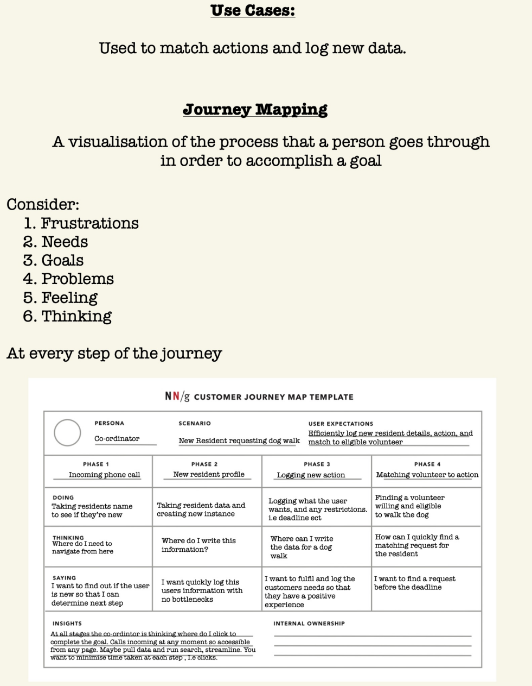

<h1 align="center">Volunteer Management App</h1>   
<div align="center">

[](https://github.com/spe-uob/2022-VolunteerManagementApp/actions/workflows/Frontend_Test.yml)
[](https://github.com/spe-uob/2022-VolunteerManagementApp/graphs/contributors)
[](https://github.com/spe-uob/2022-VolunteerManagementApp/blob/main/Application/LICENSE)
[](https://www.docker.com)
[](https://vuejs.org)
[](https://www.djangoproject.com)

</div>


<details>
  <summary>Table of Contents</summary>

- <a href="#1">Overview</a>
- <a href="#C">Contributors</a>
- <a href="#a">Gannt Chart</a>
- <a href="#2">Deployment Instruction</a>
   - <a href="#3">Backend</a>
   - <a href="#4">Frontend</a>
   - <a href="#5">Getting running</a>
- <a href="#6">Possible Issues & Bugs</a>
- <a href="#api"> API Guide </a>
- <a href="#CI">Continuous Integration</a>
- <a href="#7">UX design</a>
   - <a href="#8">Requirements</a>
   - <a href="#9">User Stories</a>
   - <a href="#10">Use Cases & Journey Mapping</a>
- <a href="#12"> Ethics </a>
</details>

<h2 id="1">Overview</h2>

We're working on a website that can be used by different communities to help self organise, keep track of need and effectively deploy help. We focus on building an intuitive front-end design and a system which all users can interact with.
The application uses a Django project integrated with a vue application.


------------------

<h2 id = "C">Contributors</h2>

- Ismael Bencharef   (IshShogun) - ha21869@bristol.ac.uk
- Linfeng Cai   (CAILINFENG123) - yn20659@bristol.ac.uk
- Bowen Wang   (Ruri22) - ki21094@bristol.ac.uk
- Xinyuan Zhang   (s1s1s) - wo21905@bristol.ac.uk
- Zhiming Liu  (LZMBill) - kf21667@bristol.ac.uk

--------------------

<h2 id = "a">1.1 Gantt Chart & Kanban</h2>

- <a href="https://docs.google.com/spreadsheets/d/17jk70c7Ysqay2RxTJ-WYFc619bPg-nvXDeJa_21MRxU/edit#gid=1962477973">Gantt Chart</a>
- <a href="https://github.com/spe-uob/2022-VolunteerManagementApp/projects/1">Kanban</a>

--------------------

<h2 id="2">1.2 Deployment Instruction</h2>

**Please see our <a href="https://github.com/spe-uob/2022-VolunteerManagementApp/releases/tag/beta-version">latest release</a> ！**

<h3 id="3">1.2.1 Backend: (Using Docker) </h3> 

- <a href="https://www.docker.com">Download & Install Docker</a>

- Clone this repository: 
``` 
git clone https://github.com/spe-uob/2022-VolunteerManagementApp.git 
```

- Start the applications using this command in the ```api``` directory: 
``` 
cd ./Allication/api/
docker-compose up --build 
```

- Then Run the following command in the ```Application``` directory ( This downloads all required node modules for the vue app ):
``` 
cd ./Allication/
docker-compose -f docker-compose.yml -f development.yml up --build
```

<h3 id="4"> 1.2.2 Frontend: </h3> 

- Direct to the ```helloworldvue``` directory and run the following commands
```
cd ./Application/api/helloworldvue/
npm install
npm run serve
```
-  Restart the tofro-django container and get running ! ! !

<h3 id="5"> 1.2.3 Getting Running! </h3> 

To get the website running open the following url:

```
http://localhost:8000/
```

Login then direct to:

```
http://localhost:8000/index
```

This is where the Vue Application is rendered. Now all that is left is to enjoy!!!

--------------------

<h2 id="6"> 1.3 Possible Issues & Bugs </h2>
If you have a windows machine and you are having issues with setup.sh then run the following commands in your terminal:

```
dos2unix setup.sh
dos2unix run.sh
dos2unix run-dev.sh
```
Ensure you execute all commands in the specified order

### 1.3.1 Found a bug !!!
If you found a bug, you can use [issue template](https://github.com/spe-uob/2022-VolunteerManagementApp/blob/main/.github/ISSUE_TEMPLATE/bug.md) to [create an issue](https://github.com/spe-uob/2022-VolunteerManagementApp/issues/new) with the tag `bug`

--------------------

<h2 id="api"> 1.4 API Guide </h2> 

| <div align="left" style="width:180px">API URL</div>         | Request Type          | <div align="left" style="width:460px">Description</div>   |
| ------------- |:-------------:| :-----|
| `api/actions/` 	| `GET`     	| retreive all the action data from a server |
| `api/actions/` 	| `POST`     	| Add actions to the database - Requires an object with `Help Type`, `Resident`, `Due`, `Status`, `Date`|
| `api/volunteers/`  | `GET`    | retreive all the volunteers data from a server |
| `api/referrals/` 	| `GET`     	| retreive all the referral data from a server |
| `api/residents/`  | `GET`     	| retreive all the resident data from a server |
| `api/residents/`  | `POST`     	| Add residents to the database - Requires an object with `first_name`, `last_name`, `address`, `postcode`, `Date`|
| `api/volunteers/`  | `GET`    | retreive all the volunteers data from a server  |
| `api/organisations/`  | `GET`     	| retreive all the organistion data from a server|
| `api/residents/37/` | `DELETE` | Deletes a resident from the database |
| `api/actions/7/` | `PATCH` | a set of changes described in the request entity be applied to the resource identified by the Request- URI|

--------------------

<h2 id="CI"> 1.5 Continuous Integration </h2>

We decided to use GitHub actions that triggers whenever we start a pull request into ``` main ```

There are two tests, one for the frontend and one for the backend
- [x] Frontend Tests
- [ ] Backend Tests

--------------------

<h2 id="7"> 1.6 UX design </h2> 
To design an interactive user interface we employed general UX design methods, such as Journey Mapping, listing user personas and requirements. We aim to follow a UX design pattern.

<h3 id="8"> 1.6.1 Requirements:</h3> 

- The site needs to be intuitive and easy to navigate/use for the coordinator
- The site needs to facilitate easy logging of new actions
- The site needs to facilitate easy matching between actions and eligible volunteers
- The site needs to facilitate efficient dealing of high priority actions
- The site needs to facilitate easy searching of actions,residents and volunteers


<h3 id="9"> 1.6.2 User Personas:</h3> 

| <div align="left" style="width:240px">User</div>         | Goal          | <div align="left" style="width:400px">Frustrations</div>   |
| ------------- |:-------------:| :-----|
| Coordinator 	| To efficiently match requests and log new data     	| Confusing UI requiring a lot of clicks and long traversals through out the interface |
| Residents 	| To quickly and efficiently give required information to coordinator     	| Long,slow drawn out phone call|
| Volunteer  | Quick matching of volunteered action    | Overlooked action for long period of times |

<h3 id="10"> 1.6.3 Use Cases & Journey Mapping: </h3> 
<a id="10">
  
</a>

--------------------

<h2 id="12">1.7 Ethics</h2> 
If coordinators use this application, we need to know their email addresses, addresses, phone numbers, and personal information. To avoid concerns about privacy and security, obtaining ethical approval is crucial.
To provide a good user experience, we have established the following ethical principles:

- We will prioritize the safety of our users.
- We will respect the privacy of our users and will never use their data for any purpose other than the intended one.
- We will listen to feedback and criticism from our users and will use it to improve our products and services.
- By adhering to these principles, we hope to create a culture of respect that benefits everyone in our group.

--------------------
