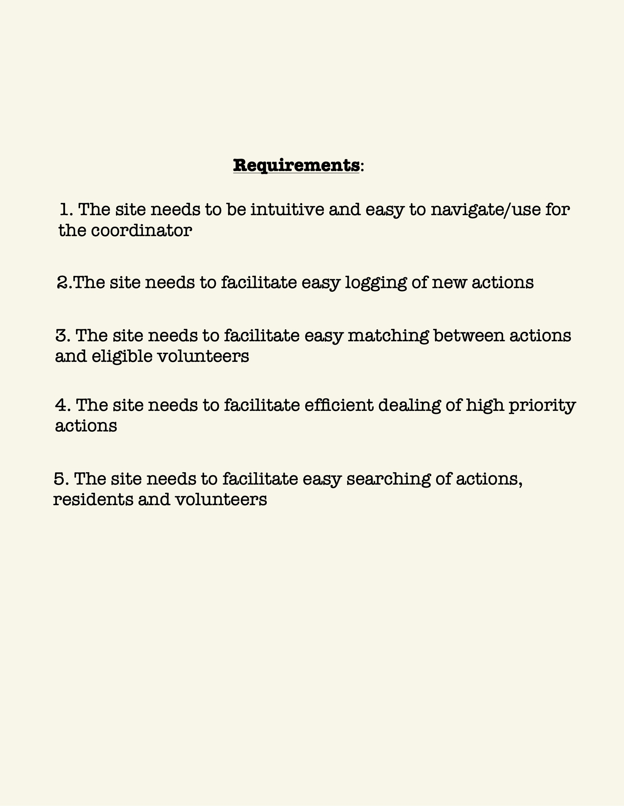

# Volunteer Management App

We're working on a website that can be used by different communities to help self organise, keep track of need and effectively deploy help. We focus on building an intuitive front-end design and a system which all users can interact with.

The application uses a Django project integrated with a vue application.

## UX design
To design an interactive user interface we employed general UX design methods, such as Journey Mapping, listing user personas and requirements. We aim to follow a UX design pattern.

## Deployment

To get running locally and quickly, download docker, clone this repository, then start the applications using this command in the api directory:

    docker-compose up --build

Then run the following command in both the api and in the vueapp directory:
    npm i

This downloads all required node modules.

## Getting Running!

To get the website running open the following url:
    http://localhost:8000/

Login then direct to:
    http://localhost:8000/index

This is where the Vue Application is rendered. Now all that is left is to enjoy!!!

