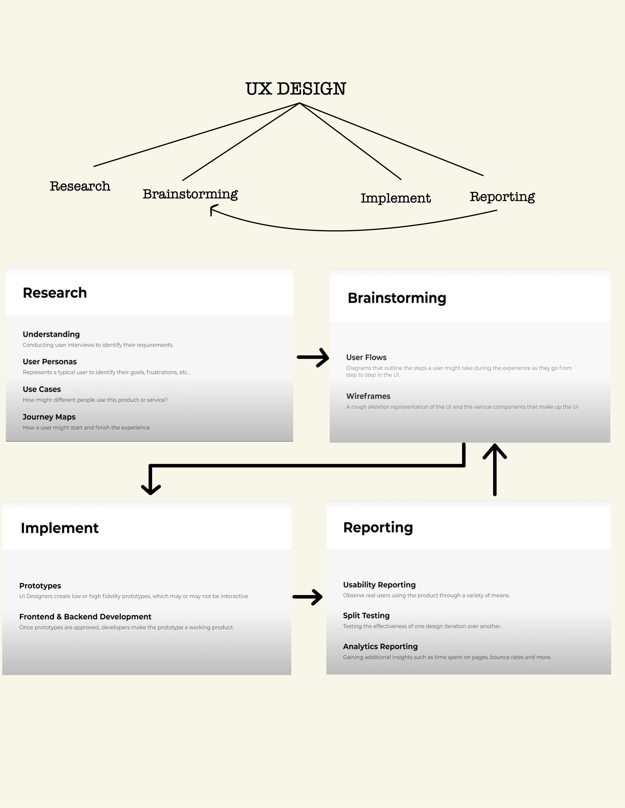
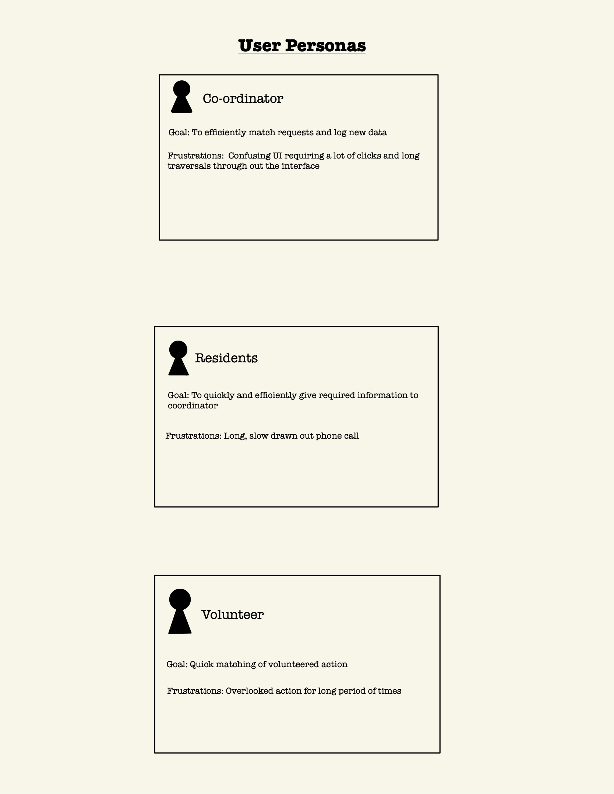
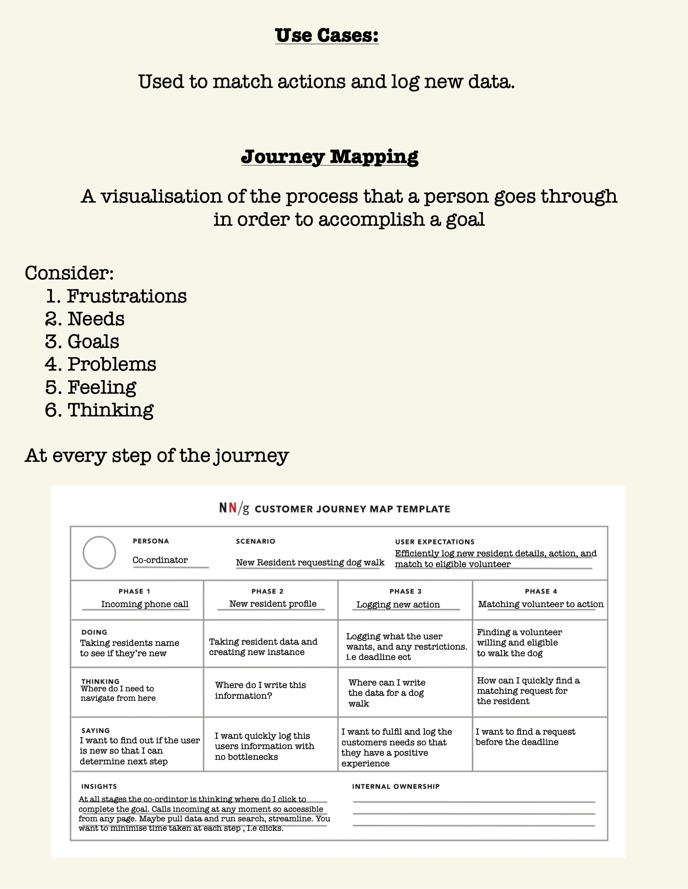

# Volunteer Management App

## Table of Contents
- <a href="#1">Overview</a>
- <a href="#2">Deployment</a>
- <a href="#3">Getting running</a>
- <a href="#4">Possible Issues</a>
- <a href="#5">UX design</a>
  - <a href="#6">Requirements</a>
  - <a href="#7">User Stories</a>
  - <a href="#8">use cases</a>
  - <a href="#8">journey mapping</a>

<h2 id="1">Overview</h2>
We're working on a website that can be used by different communities to help self organise, keep track of need and effectively deploy help. We focus on building an intuitive front-end design and a system which all users can interact with.

The application uses a Django project integrated with a vue application.


<h2 id="2"> Deployment</h2>
To get running locally and quickly, download docker, clone this repository, then start the applications using this command in the api directory:

    docker-compose up --build

Then run the following command in the home directory
    docker-compose -f docker-compose.yml -f development.yml up --build

Direct to the helloworldvue directory and run the following commands

```
npm i
npm run serve
```

This downloads all required node modules for the vue app.

Restart the tofro-django container and get running!!

<h2 id="3"> Getting Running! </h2> 

To get the website running open the following url:
    http://localhost:8000/

Login then direct to:
    http://localhost:8000/index

This is where the Vue Application is rendered. Now all that is left is to enjoy!!!

<h2 id="4">  Possible Issues </h2>
If you have a windows machine and you are having issues with setup.sh then run the following commands in your terminal:

```
dos2unix setup.sh
dos2unix run.sh
dos2unix run-dev.sh
```

Ensure you execute all commands in the specified order

<h2 id="5">  UX design </h2> 
To design an interactive user interface we employed general UX design methods, such as Journey Mapping, listing user personas and requirements. We aim to follow a UX design pattern.



<a id="6">
  
</a>

<a id="7">
  
</a>

<a id="8">
  
</a>
